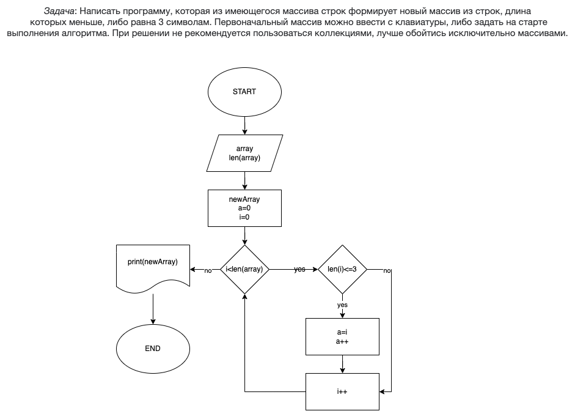

# Итоговая Задача

Написать программу, которая из имеющегося массива строк формирует новый массив из строк, длина которых меньше, либо равна 3 символам. Первоначальный массив можно ввести с клавиатуры, либо задать на старте выполнения алгоритма. При решении не рекомендуется пользоваться коллекциями, лучше обойтись исключительно массивами.

## Выполнение задачи

- Сперва необходимо вывести в консоль запрос пользователю о заполнении будущего начального массива строк:
  _Console.Write("Введите массив строк через пробел: ")_

- Затем создаем этот массив строк, указывая тип данных **string** и разделяем каждый введенный пользователем элемент пробелом:
  _string[] array = Console.ReadLine().Split(' ')_

- Следующий шаг - создание нового массива строк, элемента **i** и элемента **a**, отвечающие за индексы наших массивов:
  _string [] newArray = new string [array.Length]_
  _int a = 0_
  _int i = 0_\_

- Следующее это создание цикла **for**, отвечающего за прохождение по-очереди по каждому элементу массива, начиная с нулевого:
  _for ( i = 0; i < array.Length; i++)_

- Затем нужна еще одно условие задачи - элемент должен быть меньше либо равен 3:
  _if (array[i].Length <= 3)_

- Если элемент из начального массива соответствует нашему условию, то мы перекладываем его в наш конечный массив и увеличиваем индекс **a**:
  _newArray[a] = array[i]_
  _a++_

- Когда мы пройдемся по каждому элементу начального массива и нужные элементы сохраним в новом массиве - цикл **for** завершится и программа выведет в консоли полученный конечный массив:
  _Console.WriteLine($"Ваш конечный массив: [{string.Join(", ", newArray)}]")_

